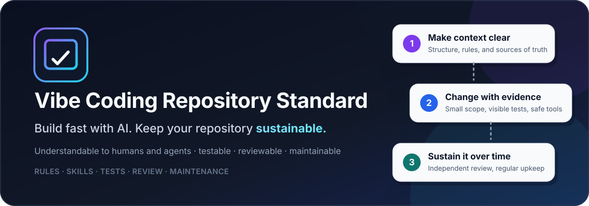
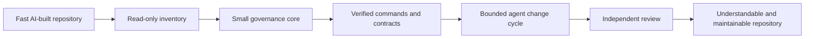
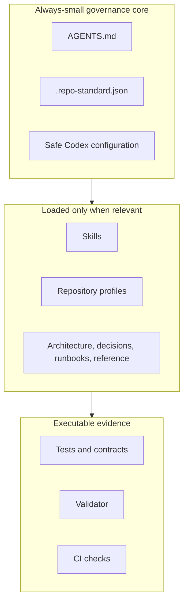
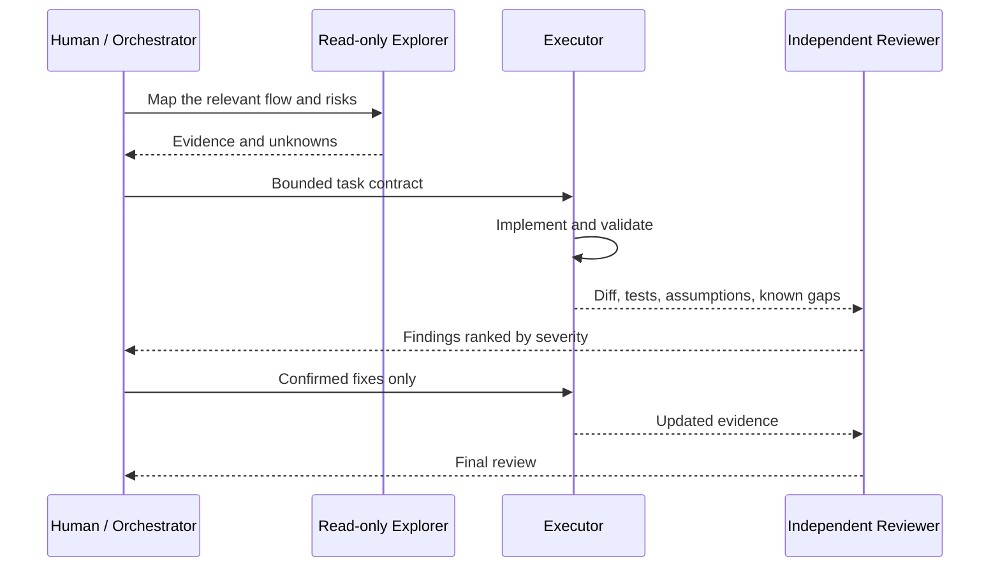

<p align="center">
  
</p>

<h1 align="center">Vibe Coding Repository Standard</h1>

<p align="center"><strong>Build fast with AI. Keep the repository understandable.</strong></p>

<p align="center">
  
  
  
  
</p>

**Vibe Coding Repository Standard (VCRS)** is an open-source community standard, starter template, and set of agent workflows for turning a fast-growing AI-built repository into software that humans and coding agents can understand, test, review, and maintain.

It is designed for vibe coders, solo builders, small teams, consultants, and maintainers who have reached a familiar point:

> The product works, but the repository no longer explains itself.

Scripts have unclear roles. Documentation disagrees with the code. Agent instruction files keep growing. Every new prompt adds more context, yet the agent seems less reliable. Refactoring feels risky because nobody—human or agent—can confidently trace the whole system.

VCRS provides a practical way out without forcing a rewrite.

## What VCRS gives you

| Need | Included approach |
|---|---|
| Understand an unfamiliar or vibe-coded repository | Audit-first bootstrap and repository mapping |
| Stop agent-context pollution | Small `AGENTS.md`, on-demand skills, explicit sources of truth |
| Make changes safely | Trace → plan → implement → test → independent review |
| Coordinate multiple coding agents | Explorer, executor, reviewer, and orchestrator roles |
| Keep documentation trustworthy | Authority labels, executable evidence, and maintenance cadence |
| Avoid framework overengineering | KISS, YAGNI, pragmatic SOLID, and smallest-defensible-change guidance |
| Apply the same governance across different projects | A mandatory core plus repository profiles, not one rigid source tree |
| Detect drift automatically | A dependency-free validator and CI workflow |



## The core idea

VCRS does **not** try to make every repository look identical. It standardizes how a repository communicates truth:

- where agent instructions belong;
- which documents are authoritative;
- how scripts and entry points are classified;
- how tests are shown in pull requests;
- how executor and reviewer agents collaborate;
- how optional MCP servers, hooks, memory, and skills are admitted;
- how stale context is removed before it becomes permanent debt.

Application source code should still follow the conventions of its language and framework.



## Who this is for

VCRS is useful when you are:

- beginning a new project with an AI coding agent;
- recovering control of a repository created through rapid prompting;
- preparing a prototype for production or external use;
- introducing a second agent to review the first agent's work;
- managing several repositories on the same machine;
- trying to reduce stale documentation, unexplained scripts, and oversized agent files;
- creating repeatable engineering practices without adopting a heavyweight platform.


## Common questions

**Is VCRS a coding framework?** No. It is a repository operating standard: a small set of rules, evidence practices, prompts, and maintenance routines that sit around your existing stack.

**Do I need multiple agents?** No. Start with one well-scoped executor. Add an independent reviewer for material changes and a read-only explorer only when the repository is difficult to trace.

**Can I use it on an existing vibe-coded codebase?** Yes. The first step is an audit, not a rewrite. VCRS maps entry points, scripts, contracts, and unknowns before it recommends structural changes.

**Does it work only with Codex?** The principles are portable, while the included configuration and ready-to-run prompts are currently tested and documented for Codex first.

More answers are in the [FAQ](docs/faq.md).

## Before and after

| Common failure mode | VCRS direction |
|---|---|
| One huge agent file contains rules, history, architecture, and temporary notes | Small permanent instructions plus focused on-demand skills |
| Agents trust stale documentation over current behavior | Executable configuration, tests, contracts, and observed evidence take priority |
| Nobody knows which scripts are production-critical | Every meaningful entry point has a purpose, caller, side effects, and validation path |
| The same agent implements and approves its own work | Executor and independent reviewer have separate responsibilities |
| Cleanup becomes a mass rewrite | Existing behavior is characterized first; changes stay small and reversible |
| Every project gets the same forced directory tree | Projects select one or more profiles and preserve language-native conventions |
| MCP, hooks, and memory are enabled because they look useful | Optional capabilities must pass an admission trial and have a clear owner and boundary |
| Documentation grows forever | PR-time and quarterly hygiene remove or repair stale context |

## Start here

### 1. Understand the approach

Read the [white paper](WHITEPAPER.md) for the problem, design model, adoption stages, and limitations in approachable language.

For a faster introduction, use the [15-minute getting-started guide](docs/getting-started.md).

### 2. Choose your situation

**Existing repository:** start with the read-only bootstrap prompt. It inventories the project before proposing changes.

- [`standard/prompts/01-bootstrap-repository.prompt.md`](standard/prompts/01-bootstrap-repository.prompt.md)

**Several repositories on one machine:** begin with inventory-only mode and adopt the standard one repository at a time.

- [`standard/prompts/00-machine-wide-rollout.prompt.md`](standard/prompts/00-machine-wide-rollout.prompt.md)

**New repository:** adapt the starter template rather than copying it blindly.

- [`standard/template/`](standard/template/)

### 3. Use the normal change cycle

After bootstrap, use the executor/reviewer workflow:

- [`standard/prompts/02-multi-agent-change-cycle.prompt.md`](standard/prompts/02-multi-agent-change-cycle.prompt.md)



### 4. Validate the starter template

The validator uses only the Python standard library:

```bash
python standard/template/scripts/maintenance/validate_repository_standard.py \
  --root standard/template
```

Run its tests with:

```bash
python -m unittest discover \
  -s standard/template/tests/standards \
  -p 'test_*.py' \
  -v
```

## Repository map

| Path | What it contains |
|---|---|
| [`WHITEPAPER.md`](WHITEPAPER.md) | The approachable product and design paper |
| [`docs/getting-started.md`](docs/getting-started.md) | A safe first adoption path |
| [`docs/faq.md`](docs/faq.md) | Direct answers for beginners and experienced maintainers |
| [`docs/glossary.md`](docs/glossary.md) | Plain-language definitions of agent and repository terms |
| [`docs/publication-audit.md`](docs/publication-audit.md) | Sensitive-information, licensing, and public-readiness audit |
| [`docs/discovery-and-launch.md`](docs/discovery-and-launch.md) | GitHub metadata, SEO/GEO, launch, and discovery guidance |
| [`llms.txt`](llms.txt) | A concise, experimental source map for machine readers; not a ranking or access-control file |
| [`standard/`](standard/) | Navigation for the handbook, profiles, prompts, machine profile, and starter template |
| [`standard/handbook/`](standard/handbook/) | The detailed normative guidance and execution plans |
| [`standard/profiles/`](standard/profiles/) | Single-application, monorepo, data-platform, and infrastructure profiles |
| [`standard/prompts/`](standard/prompts/) | Ready-to-run Codex prompts for bootstrap, review, maintenance, and tool trials |
| [`standard/machine-profile/`](standard/machine-profile/) | Conservative user-level Codex profile references |
| [`standard/template/`](standard/template/) | The adaptable repository starter and validator |

## Design principles

1. **Start fresh with context, not with facts.** Preserve evidence about existing behavior before deleting or rewriting it.
2. **Keep always-loaded instructions small.** Load specialized workflows only when they are relevant.
3. **Prefer executable truth.** Tests, migrations, contracts, configuration, and runtime evidence outrank stale prose.
4. **Make the smallest defensible change.** Avoid speculative abstractions, dependencies, and broad cleanup.
5. **Separate creation from approval.** A non-trivial change should receive independent review.
6. **Treat optional tooling as a capability with risk.** MCP, hooks, memory, and indexing tools need boundaries and evidence.
7. **Maintain the context layer.** Agent files and documentation need owners, validation, and deletion criteria.
8. **Protect safety work from minimalism.** Tests, security controls, migrations, observability, and recovery evidence are not bloat.

## Current compatibility

VCRS is **agent-agnostic at the principles level** and **Codex-first in the reference implementation**. It is an independent community project, not an OpenAI product or endorsement.

| Environment | Current status |
|---|---|
| OpenAI Codex | Reference prompts, configuration, skills, and custom-agent roles included |
| Tools that read `AGENTS.md` | Core governance concepts are portable, but behavior should be verified per tool |
| Claude Code, Cursor, GitHub Copilot, Gemini CLI, and others | Adapter contributions are welcome; no universal compatibility claim is made yet |
| MCP integrations | Optional and disabled by default until admitted for a specific repository |

## What this project is not

VCRS is not:

- a replacement for knowing what your product should do;
- an automatic proof that a repository is production-ready;
- a framework that rewrites every project into one architecture;
- a reason to install every AI coding tool or MCP server;
- a substitute for security review, testing, backups, or human judgment;
- a promise that multiple agents will always outperform one well-guided agent.

## Public preview status

Version `0.1.0` is a public preview. The standard is usable now, but the community still needs to validate it across more languages, frameworks, repository sizes, and coding-agent environments.

See the [roadmap](ROADMAP.md) and [governance model](GOVERNANCE.md).

## Questions and help

- Start with the [FAQ](docs/faq.md).
- Use the repository's **Discussions** tab for questions, adoption stories, and design conversations.
- Use an **Issue** for a reproducible defect, broken link, validator bug, or concrete standard proposal.
- Read [`SUPPORT.md`](SUPPORT.md) before sharing logs or repository excerpts.

## Contributing

Contributions are welcome from experienced engineers, new vibe coders, documentation writers, security reviewers, and agent-tool authors. A useful contribution can be as small as clarifying one confusing paragraph or adding one evidence-backed repository profile example.

Read [`CONTRIBUTING.md`](CONTRIBUTING.md) and the [`CODE_OF_CONDUCT.md`](CODE_OF_CONDUCT.md) before opening a pull request.

## License and acknowledgments

VCRS is licensed under the [Apache License 2.0](LICENSE).

The project was informed by official OpenAI Codex guidance, GitHub repository practices, software design literature, and open-source projects including Ponytail and Codebase Memory MCP. No source code from those projects is vendored here. See [`THIRD_PARTY_NOTICES.md`](THIRD_PARTY_NOTICES.md) and the [source register](standard/handbook/09-source-register.md).

---

<p align="center"><strong>Fast creation and long-term maintainability do not have to be opposites.</strong></p>
