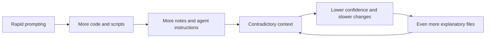
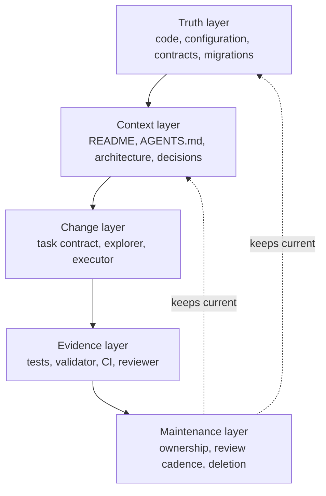
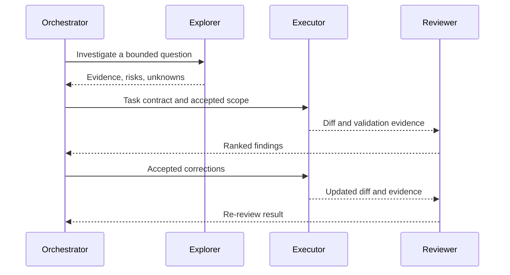

# From vibes to verifiable software

## An approachable white paper for the Vibe Coding Repository Standard

**Project:** Vibe Coding Repository Standard (VCRS)  
**Version:** 0.1.0 public preview  
**Published:** August 15, 2026  
**License:** Apache License 2.0

## Executive summary

AI coding agents make it possible to move from an idea to working software faster than ever. That is the promise of vibe coding: describe the outcome, let an agent produce much of the implementation, try it, and keep iterating.

The speed is real. So is a second pattern that often appears later:

- the product works, but nobody can clearly explain the repository;
- scripts have overlapping or unknown purposes;
- documentation describes older versions of the system;
- agent instruction and memory files grow until they contain rules, history, plans, and contradictions;
- tests are incomplete or difficult to connect to real behavior;
- the same agent makes a change and then declares its own work correct;
- cleanup feels as risky as adding another feature.

VCRS is an open-source community operating standard for that point in a project's life. It helps humans and coding agents understand what exists, preserve important behavior, make bounded changes, show evidence, and remove stale context without forcing a rewrite or one universal application architecture.

The standard has five ideas:

1. **Truth has an explicit home.** Code, tests, contracts, configuration, decisions, and runbooks have different jobs.
2. **Agent context stays small.** Permanent instructions contain only rules every task needs; specialized workflows load on demand.
3. **Existing repositories are audited before they are reorganized.** A cleaner copy is not considered complete until continuity is demonstrated.
4. **Changes move through an evidence cycle.** Trace, plan, implement, test, review, and re-review.
5. **The context layer is maintained like code.** Agent files and documentation have owners, checks, and deletion criteria.

VCRS is agent-compatible at the principles level and Codex-first in its current reference implementation. It is an independent community project, not an OpenAI product or endorsement. It is a public preview, not a certification system and not a guarantee that a repository is secure or production-ready.

## 1. What is vibe coding?

Vibe coding is a development style in which a person guides an AI coding agent mainly through natural-language goals, examples, and feedback. The human may read every line, some lines, or very little of the generated code.

This can be a rational way to explore an idea. It lowers the cost of trying a design, learning a framework, automating a personal workflow, or building an early product. The problem is not the use of AI-generated code. The problem begins when **creation speed grows faster than understanding, verification, and maintenance capacity**.

A prototype can tolerate uncertainty that an operational system cannot. As a project gains users, data, schedules, integrations, deployments, or contributors, questions become more important:

- What starts the application?
- Which script is safe to run?
- What is the source of truth for a configuration value?
- Which database changes are required?
- What happens when a job fails halfway through?
- Which test protects a user-visible contract?
- Which document is current?
- What may an agent access or change?
- Who independently reviewed the result?

VCRS makes those questions answerable without taking away the speed that made the project possible.

## 2. The hidden cost: context debt

Technical debt is the future cost created by today's implementation choices. VCRS uses the term **context debt** for a related problem: the cost created when the repository no longer provides a reliable explanation of itself.

Context debt accumulates when:

- permanent rules and temporary task notes live in the same file;
- several documents claim to be authoritative;
- generated summaries are committed as if they were verified facts;
- scripts do not declare their inputs, outputs, callers, or side effects;
- old architecture remains searchable beside the new architecture;
- agent memory becomes the only record of an important decision;
- optional tools silently add instructions, hooks, or broad permissions;
- tests exist but their relationship to real requirements is unclear.

More context does not automatically solve context debt. Loading every historic document can make an agent slower and less reliable because it must resolve more contradictions. The goal is not maximum context. It is **the smallest sufficient set of current, authoritative, and task-relevant context**.

## 3. Design goals

VCRS is designed around seven goals.

### 3.1 Preserve behavior before improving appearance

An existing repository may look disorganized while containing important operational knowledge. A file that appears unused may be called by a scheduler, deployment platform, operator, or external system. The standard therefore starts with a read-only inventory and continuity analysis rather than mass deletion or renaming.

### 3.2 Standardize the operating surface, not every source tree

A Python service, TypeScript application, data platform, infrastructure repository, and monorepo should not be forced into the same application layout. VCRS standardizes the repository's governance surface—agent instructions, evidence, documentation roles, review protocol, and validation—while preserving language and framework conventions.

### 3.3 Prefer executable evidence

Prose is valuable for explanation and decisions. It is a weak substitute for facts a machine can verify. A schedule belongs in version-controlled configuration. A file format belongs in a contract test. A database history belongs in migrations. A safety rule should be enforced by permissions, sandboxing, tests, or CI whenever possible.

### 3.4 Keep changes small and reversible

A bounded change is easier to understand, review, test, merge, and roll back. VCRS discourages mixing feature work, architecture restructuring, dependency upgrades, and broad cleanup in one change.

### 3.5 Separate creation from approval

An agent can critique its own output, but that is not independent review. Material changes should be examined by a reviewer with a read-only mandate, the full task contract, the complete diff, and the test evidence.

### 3.6 Add complexity only when evidence justifies it

Skills, custom agents, memory systems, hooks, MCP servers, indexing services, abstractions, and frameworks can all be useful. None should be adopted merely because it is available. Each adds another surface to understand and maintain.

### 3.7 Remain approachable

A standard that only experts can apply will not help the people most exposed to context debt. VCRS uses plain language, direct examples, conservative defaults, and an incremental adoption path.

## 4. The five-layer model

VCRS organizes repository health into five layers.

### 4.1 Truth layer

The truth layer contains the sources that define or demonstrate current behavior:

- application code;
- executable configuration;
- database migrations;
- schemas and interface contracts;
- tests and fixtures;
- deployment and scheduling definitions;
- observed runtime evidence, when safely collected.

The truth layer can still contain defects. Its role is not to be infallible; its role is to provide stronger evidence than an unverified narrative.

### 4.2 Context layer

The context layer helps people and agents navigate the truth layer:

- `README.md` explains what the project is, why it is useful, how to start, and where to get help;
- `AGENTS.md` contains short, permanent repository instructions;
- architecture documents explain system boundaries and flows;
- decision records explain why important choices were made;
- runbooks explain operational procedures;
- reference documents record exact commands and contracts.

Each document type has one job. Temporary task state belongs in an issue, pull request, or execution report—not in permanent agent instructions.

### 4.3 Change layer

The change layer defines how work proceeds:

1. frame a bounded task with acceptance criteria;
2. trace the relevant execution flow;
3. identify risks, contracts, and unknowns;
4. propose the smallest defensible change;
5. implement without unrelated cleanup;
6. collect evidence.

For complex work, a read-only explorer can map the repository before an executor writes code.

### 4.4 Evidence layer

The evidence layer answers, “Why should we believe this change works?” It includes:

- unit, contract, integration, and smoke tests;
- static analysis and formatting;
- the VCRS validator;
- security and secret checks;
- pull-request evidence;
- independent review.

A useful pull request does not merely say “tests pass.” It shows the important scenarios, expected outcome, actual outcome, command or method used, and anything not tested.

### 4.5 Maintenance layer

The maintenance layer prevents a clean repository from becoming confusing again. It defines:

- owners for authoritative files;
- review dates for volatile guidance;
- PR-time hygiene;
- periodic agent/context review;
- rules for archiving or deleting stale material;
- versioning and exceptions for the standard itself.

## 5. The repository operating core

The VCRS starter includes a small core that can be adapted to a project:

| Component | Purpose |
|---|---|
| `AGENTS.md` | Short, permanent instructions every agent task needs |
| `.repo-standard.json` | Machine-readable profile, version, ownership, capabilities, and exceptions |
| `.codex/config.toml` | Conservative Codex reference configuration |
| `.codex/agents/` | Separate explorer, executor, and reviewer roles |
| `.agents/skills/` | Focused workflows loaded only when relevant |
| `docs/` | Architecture, decisions, runbooks, and reference material |
| `scripts/` | Discoverable command surface and maintenance tooling |
| `tests/standards/` | Tests for repository-standard enforcement |
| `.github/` | Pull-request evidence and CI validation |

The core is intentionally not copied blindly into an existing repository. Bootstrap first identifies equivalent files, established conventions, and risks. It then proposes a minimal compatible baseline.

## 6. Multi-agent development without an agent swarm

VCRS uses a small role model.

| Role | Responsibility | Default permission |
|---|---|---|
| Human or orchestrator | Owns scope, acceptance criteria, and final decisions | Coordinates work |
| Explorer | Maps entry points, dependencies, contracts, and unknowns | Read-only |
| Executor | Implements one bounded task and produces evidence | Workspace write |
| Reviewer | Finds defects and checks the task contract independently | Read-only |

This model avoids two extremes: one agent acting as author, judge, and historian; or a large agent swarm producing duplicated work and uncontrolled context. Small tasks may need only an executor and normal human review. The roles are tools, not ceremony requirements.

## 7. Repository profiles

VCRS provides four profiles:

- **Single application:** one primary deployable application or service.
- **Monorepo:** several applications, packages, or independently owned areas.
- **Data platform:** pipelines, schedules, schemas, contracts, and analytical outputs.
- **Infrastructure:** infrastructure-as-code, environments, deployment, and recovery.

A repository may select a primary profile and one or more secondary profiles. Profiles identify evidence and operational questions that are easy to miss; they do not impose a universal directory tree.

## 8. Adoption paths

### 8.1 Existing repository

The safest path is:

1. preserve the current repository and deployed evidence;
2. run an audit-only bootstrap;
3. inventory entry points, scripts, instruction files, docs, and risks;
4. identify the current sources of truth;
5. add only the minimal governance surface;
6. create characterization and contract tests for critical behavior;
7. refactor incrementally after continuity is demonstrated.

A manually created “lite” repository can be a useful candidate, but deletion from the original does not prove a capability was unnecessary. Fresh governance should not mean fresh assumptions.

### 8.2 New repository

A new project can adapt the starter template early, remove irrelevant sections, record verified commands, select a profile, and use the normal change cycle from the beginning.

### 8.3 Several repositories on one machine

Machine-level instructions should remain project-neutral. Project knowledge belongs in each repository. VCRS recommends inventorying repositories first, piloting the standard on one healthy project, and rolling it out in waves rather than allowing one automated process to rewrite every repository.

## 9. Safety, privacy, and tool boundaries

Agent productivity is not a substitute for access control. The reference configuration begins with workspace-scoped writes, approval for consequential actions, disabled network access where practical, no persistent memory, no hooks, and no default MCP servers.

For external tools, VCRS asks:

- What problem does this capability solve?
- Which environment and data can it access?
- Is it read-only or mutating?
- What requires human approval?
- How is output constrained and audited?
- How is it disabled and removed?
- When will the admission decision be reviewed?

Production access, deployments, destructive migrations, client or personal data, and external side effects require separate authorization and safeguards. A prose rule alone is not a security boundary.

## 10. Measuring whether the standard helps

VCRS should be evaluated by outcomes, not by file count. Useful measures include:

- time for a new human or agent to locate the correct entry point;
- percentage of documented commands that run successfully;
- size of always-loaded agent instructions;
- number of unknown or duplicate scripts;
- review findings caught before merge;
- percentage of pull requests with scenario-level test evidence;
- stale or conflicting authoritative documents;
- time to recover from a failed scheduled job or deployment;
- bootstrap diff size and unrelated-change rate;
- false positives and false confidence from the validator.

A project should remove rules that create ceremony without improving safety, clarity, or evidence.

## 11. Limitations and non-goals

VCRS does not:

- prove that application logic is correct;
- replace product knowledge, threat modeling, or professional security review;
- guarantee that one agent tool interprets another tool's files identically;
- make persistent memory or MCP inherently safe;
- recommend multi-agent execution for every task;
- define one architecture for all projects;
- automatically determine whether an apparently unused script has an external caller;
- guarantee search-engine or generative-engine visibility;
- eliminate the need for human judgment.

The current release is Codex-first. Adapter contributions for other coding agents need testing against each tool's instruction precedence, permissions, and workflow behavior before compatibility is claimed.

## 12. Open-source direction

VCRS is published as an open-source standard because repository maintainability is a shared problem. The project welcomes:

- anonymized adoption reports;
- improvements to beginner guidance;
- validator fixes and portability tests;
- evidence-backed profiles;
- carefully scoped adapters for other agents;
- translations;
- security and privacy review;
- examples showing where the standard is too strict or too weak.

The project will consider a stable 1.0 release only after the mandatory core has been exercised across several repository types and its upgrade and governance processes have been tested.

## Conclusion

Vibe coding changes who can create software and how quickly an idea can become real. Its long-term value depends on whether the resulting software can still be understood, verified, repaired, and safely changed.

VCRS treats maintainability as a continuation of creative speed, not its opposite:

> Start fresh with context and governance, but never start fresh with facts.

## References and further reading

The complete, dated source register is maintained in [`standard/handbook/09-source-register.md`](standard/handbook/09-source-register.md). Major influences include official OpenAI Codex documentation, Model Context Protocol security guidance, GitHub open-source community guidance, Google engineering review practices, Diátaxis, the C4 model, Secure by Design guidance, Ponytail, and Codebase Memory MCP.
